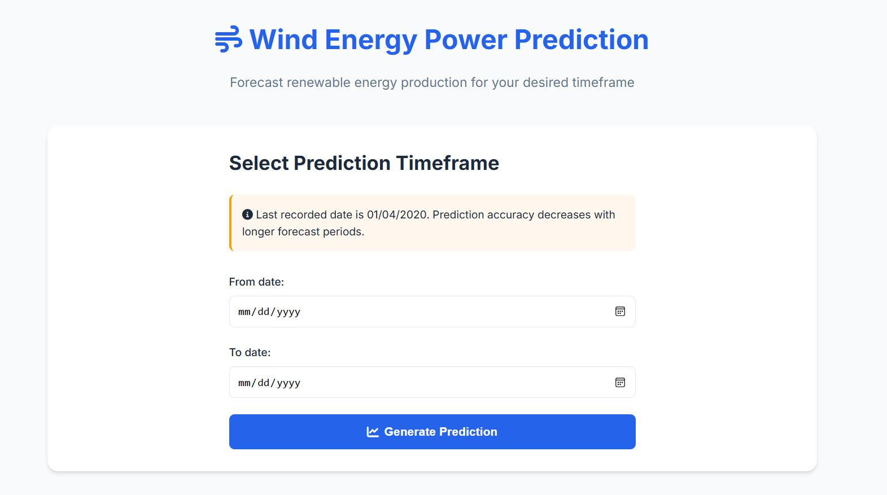

# Wind Energy Power Prediction

A sophisticated Flask web application that leverages machine learning to forecast wind energy power production. This project demonstrates the practical application of time series analysis and XGBoost modelling for renewable energy prediction.

## Table of Contents

- [Features](#features)
- [Technical Analysis](#technical-analysis)
- [Data Insights](#data-insights)
- [Model Development](#model-development)
- [Installation](#installation)
- [Usage](#usage)
- [Project Structure](#project-structure)
- [Contributing](#contributing)

## Features

- Interactive date selection for prediction timeframe
- Visual representation of predicted wind energy production
- Responsive and modern user interface
- Historical data-based predictions using XGBoost model
- Mobile-friendly design
- Real-time forecasting capabilities

## Screenshots

### Main Dashboard


_Input form for prediction timeframe selection_

### Prediction Results


_Visualization of predicted wind energy production_

## Technical Analysis

### Dataset Overview

The analysis utilises a comprehensive wind turbine dataset containing various sensor measurements and operational parameters:

- Active Power Output (target variable)
- Environmental parameters (Wind Speed, Direction, Ambient Temperature)
- Mechanical measurements (Bearing Temperature, RPM)
- Operational controls (Blade Pitch Angles, Nacelle Position)
- Derived temporal features (hour, day, month, etc.)

### Data Insights

#### Feature Correlations


_Comprehensive correlation analysis of turbine parameters_

Our correlation analysis revealed several key relationships with Active Power generation:

**Strong Positive Correlations:**

- Wind Speed (0.537): Primary driver of power generation
- Rotor RPM (0.935): Nearly linear relationship
- Generator RPM (0.934): Direct mechanical conversion
- Generator Winding Temperatures (0.927-0.928): Heat generation from power production

**Moderate Correlations:**

- Bearing and Oil Temperatures (0.61-0.86): Mechanical system health indicators
- Ambient Temperature (0.819): Environmental impact
- Hub Temperature (0.372): Indirect operational indicator

**Negative Correlations:**

- Blade Pitch Angles (-0.042 to -0.044): Control mechanisms
- Turbine Status (-0.001): Operational states

#### Time Series Patterns

The temporal analysis revealed several interesting patterns:

1. **Wind Speed vs Power Production**


_Relationship between wind speed and active power production over time_

- Strong daily and seasonal patterns
- Non-linear relationship at extreme speeds
- Clear cut-in and cut-out wind speed thresholds

2. **Wind Direction Impact**


_Impact of wind direction on power generation_

- Directional dependency of power generation
- Optimal wind direction sectors identified
- Turbulence effects visible in power fluctuations

### Model Development

#### Feature Engineering

1. **Temporal Features**

   - Hour of day: Capture daily patterns
   - Day of week: Weekly trends
   - Month and Year: Seasonal variations
   - Day of year: Annual patterns

2. **Data Preprocessing**
   - Handled missing values using forward fill
   - Normalized numerical features
   - Encoded categorical variables
   - Dataset size: 78,989 records split into training and testing sets

#### Model Architecture

**XGBoost Regressor Configuration:**

- n_estimators: 200 (optimal after cross-validation)
- early_stopping_rounds: 50 (prevent overfitting)
- Evaluation metric: RMSE
- Training approach: Time-series cross-validation

#### Model Performance Evolution

**Initial Model:**

- R-squared (R²): 0.978
- RMSE: 88.66 kW
- MAPE: 8.47%
  _Strong performance but showed signs of overfitting_

**Optimised Model:**

- R-squared (R²): 0.843
- RMSE: 519.32 kW
- MAPE: 4.14%
  _Better generalisation with acceptable accuracy trade-off_

### Prediction Capabilities

#### Short-term Forecasting (24-48 hours)


_Model performance on short-term predictions showing actual vs predicted values_

- High accuracy (MAPE < 5%)
- Captures daily patterns effectively
- Reliable for operational planning

#### Long-term Forecasting (1-2 months)


_Extended forecast showing predicted power generation patterns_

- Moderate accuracy (MAPE < 15%)
- Captures seasonal trends
- Suitable for capacity planning

## Installation

1. Clone the repository:

```bash
git clone <your-repository-url>
cd forecasting-renewable-energy-app
```

2. Install required dependencies:

```bash
pip install -r requirements.txt
```

3. Run the application:

```bash
python app/app.py
```

4. Open your web browser and navigate to:

```
http://127.0.0.1:5000
```

## Project Structure

```
forecasting-renewable-energy-app/
├── app/
│   ├── app.py              # Main Flask application
│   ├── model.py            # ML model and data processing
│   ├── static/
│   │   ├── style.css       # Application styling
│   │   └── output.png      # Generated prediction plots
│   └── templates/
│       └── index.html      # Main application template
├── notebooks/             # Jupyter notebooks
│   └── forecasting-renewable-energy-XGB.ipynb  # Analysis notebook
└── requirements.txt        # Project dependencies
```

## Usage

1. Access the application through your web browser
2. Select a start date and end date for the prediction
   - Note: Last recorded date is 01/04/2020
   - Prediction accuracy decreases with longer forecast periods
3. Click "Generate Prediction" to view the forecast
4. The results will be displayed as a time series graph

## Data Limitations

- Last recorded date in the dataset: 01/04/2020
- Prediction accuracy decreases for longer forecast periods
- Historical data is used for training the model

## Uploading to GitHub

1. Create a new repository on GitHub (don't initialize with README)

2. Initialize git in your local project (if not already done):

```bash
git init
```

3. Add your files to git:

```bash
git add .
```

4. Commit your changes:

```bash
git commit -m "Initial commit"
```

5. Add your GitHub repository as remote:

```bash
git remote add origin <your-github-repository-url>
```

6. Push your code to GitHub:

```bash
git push -u origin main
```

## Contributing

Feel free to fork this project and submit pull requests with improvements. You can also open issues for bugs or feature requests.

## Contact

For any questions or feedback, please open an issue in the GitHub repository.
